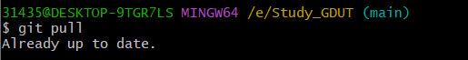

# Study_GDUT
### 简介

供软工三班同学食用，也可以发给其他班同学。每一个科目内含前人整理的资料以及各位同学收集到课内外的资料。如果有同学想将自己的资料分享给大家，可以联系学委📢

希望在剩下几周时间内，大家可以认真复习👍，❌拒绝摆烂

### 使用

* 第一次食用的话要现在本地克隆

```linux
git clone https://github.com/CodeGrindstone/Study_GDUT.git
```

* 克隆后，再命令行输入git pull就好啦




### 待办事项

+ [x] 算法设计历史作业与答案
+ [x] 操作系统考试范围
+ [ ] 计算机网络考试范围
+ [x] 计算机组成原理考试范围
+ [ ] 计算机网络复习笔记（已完成5、6章，剩余会持续更新，也会更新考试范围相关的例题）


### 其他资料

* 408 学习资料：[cen6667/408: 408学习资料和课程笔记（非考研）数据结构、操作系统、计算机网络、计算机组成原理 (github.com)](https://github.com/cen6667/408)


### 致谢

* 计算机学院的先辈们
* 22级软工三班李宇康
* 22级软工三班邹嘉伟

