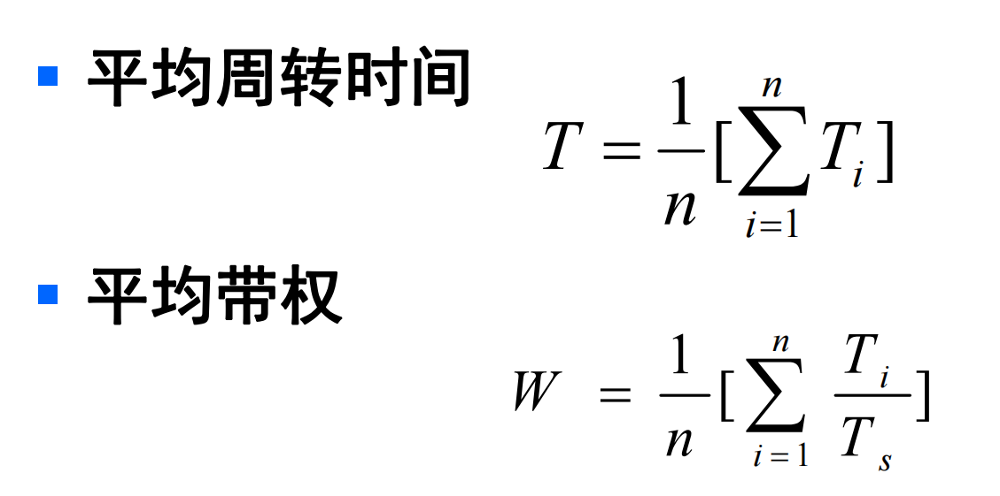

# 操纵系统复习笔记

## 第一章 操作系统引论

1. 操作系统的基本特性
   * 并发
   * 共享
   * 虚拟
   * 异步

## 第二章 进程的描述与控制

1. 进程定义

   * 进程是程序的一次执行
   * 进程是一个程序机器数据在处理机上顺序执行所发生的活动
   * 进程是具有独立功能的程序在一个数据集合上运行的过程，它是系统进行资源分配和调度的一个独立单位

2. 进程状态

   * 三种基本状态

     * 继续
     * 执行
     * 阻塞

     

     

   * 引入挂起操作的三个进程的转换     

## 第三章 处理机调度与死锁

### 3.1 处理机调度的基本概念

* 高级调度：==将作业从外存调入内存==，一般用于批处理系统，分/实时系统一般直接入内存
* 低级调度(进程调度)：由分派程序为为作业分派处理机
  * 非抢占式
  * 抢占方式
    * 时间片原则
    * 优先权原则
    * 短作业优先原则
* 中级调度：提高内存利用率和系统吞吐量而引入的内外存对换功能

==**调度算法的若干准则**==

### 3.2 调度算法

#### 3.2.1 先来先服务和短作业（进程）优先调度算法

* FCFS：简单、利于长作业
* SJ(P)F：降低了平均周转时间和平均带权周转时间(提高了系统吞吐量)、对长作业不利、估计时间不易确定

#### 3.2.2 高优先权优先调度算法

1. **优先权调度算法类型**
   * 非抢占式优先权算法
   * 抢占式优先权算法
2. **优先权类型**
   * 静态优先权：进程优先权在整个运行期间不变
   * 动态优先权：优先权随着执行时间而下降、随等待时间而升高
     * ==相应比 Rp = （等待时间 + 已服务时间）/ 已服务时间==
   * 高相应比优先算法：
     * 相应比 = （等待时间+要求 服务时间 ）/ 要求服务时间

#### 3.2.3 基于时间片的轮转调度算法

### 3.3 实时调度

#### 3.3.2 实时调度算法的分类

1. 非抢占式调度算法
   * 时间片轮转
   * 非抢占式优先权
2. 抢占式调度算法
   * 时钟中断抢占优先权
   * 立即抢占

#### 3.3.3 常用的几种实时调度算法

1. **最早截止时间优先EDF**
   * 根据任务的开始截止时间来确定任务的优先级
   * 截止时间越早，优先级越高
   * 可以是抢占式或非抢占式
2. **最低松弛度优先LLF算法**
   * 松弛度：根据任务紧急程度，来确定优先级
   * ==松弛程度 = 完成截止时间 - 处理时间 - 当前时间==
   * 主要用于抢占式的调度方式

## 第四章 存储器管理

## 第五章 虚拟存储器

## 第六章 输入输出系统

## 第七章 文件管理

## 第八章 磁盘存储器管理

