# 第一章

### 1.2 互联网概述

* 理解：1.2.1 网络的网络

* 了解：1.2.2 互联网基础结构发展的三个阶段 和 1.2.3 互联网的标准化工作

## 1.3 互联网组成（掌握）

三种方式的优缺点、差异

## 1.5 计算机网络的类别（理解）

## 1.6 计算机网络的性能（掌握）

1.6.1 计算机网络的性能指标

* 速率
* 吞吐量
* 贷款及
* 时延
* ..........

## 1.7 计算机网络体系（掌握）

* 掌握：1.7.2 协议与划分层次

* 掌握：1.7.3 具有五层协议的体系结构

# 第二章 物理层（简单看）

###2.1 物理层的基本概念(掌握)

* 物理层的作用

### 2.2 数据通信的基础知识（理解）

* 了解：2.2.1 数据通信的模型

* 了解： 2.2.2 有关通信的几个基本概念

* 理解：2.2.3 信道的极限容量

### 2.3 物理层下面的传输媒体（了解）

### 2.4 信道复用技术（理解）

==码分复用==

### 2.5 宽带接入技术

# 第三章 数据链路层（掌握）

### 3.1 数据链路层的几个共同问题

### 3.1.2 三个基本问题

* 差错检测

### 3.2 点对点协议PPP（理解）

### 3.3 使用广播信道的数据链路层

* 理解：3.3.2 CSMA/CD 协议
* 了解：3.3.3和3.3.5

### 3.4 扩展的以太网（掌握）

* 理解：3.4.3 虚拟局域网

### 3.5 高速以太网（简单看）

# 第四章 网络层（考试占一半）

### 4.1 网络层的几个重要概念(掌握)

* 掌握：4.1.1 网络层提供的两种服务（对比、优缺点）

  * 面向连接的虚电路（核心思想“可靠通信应该由网络自身来保证”）
  * 无连接的数据报服务（核心思想“可靠通信由用户主机来保证”）

  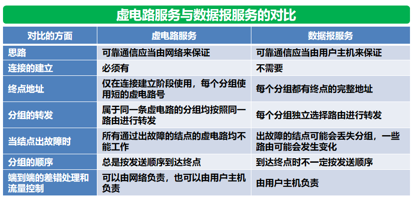
* 掌握：4.1.2 网络层的两个层面（数据、控制）

  在路由器之间传送的信息有两大类：

  1. 数据
  2. 路由信息

  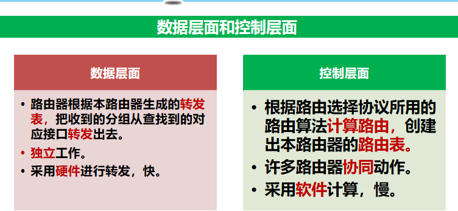

### 4.2 网际协议IP（掌握）

all in

* 掌握：4.2.2 IP地址

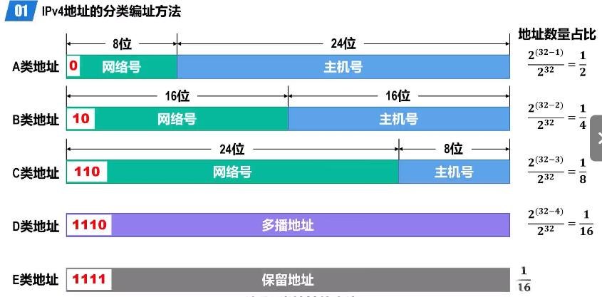

* 理解：4.2.3 IP地址与MAC地址
* 掌握：4.2.5 IP数据报的格式
* 其他节都要看  

### 4.3 IP层转发分组的过程（掌握，要会画路由表）

* 掌握：4.3.1 基于终点的转发
* 掌握：4.3.2 最长前缀匹配·

### 4.4 网际控制报文协议ICMP（了解）

### 4.5 IPV6（了解）

###4.6 互联网的路由选择协议（掌握）

* 掌握：4.6.2 内部网关协议 RIP

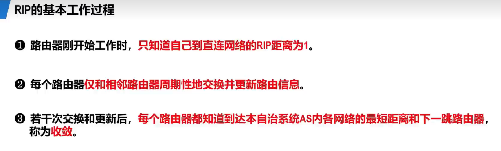

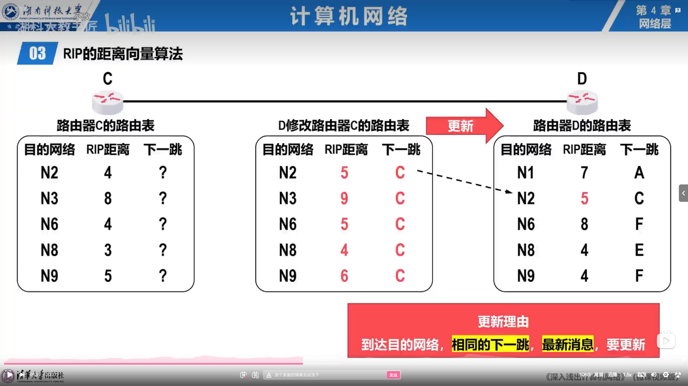

* 理解：4.6.3 内部网关协议OSPF
* 理解：4.6.4 外部网关协议 BGP

# 第五章 运输层（和第四章也是重点）

### 5.1 运输层协议概述（理解）

### 5.2 用户数据报协议UDP（理解）

### 5.4 可靠运输的工作原理（掌握）

### 5.6 TCP可靠传输的实现（掌握）

### 5.7 TCP的流量控制（理解）

# 第六章 应用层（不考）

## 大题

### 第二章

#### 信道的极限容量

1. 奈式准则

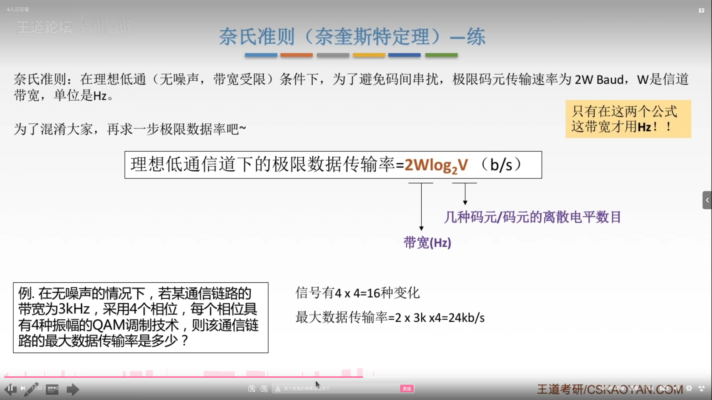 

2. 香农定理

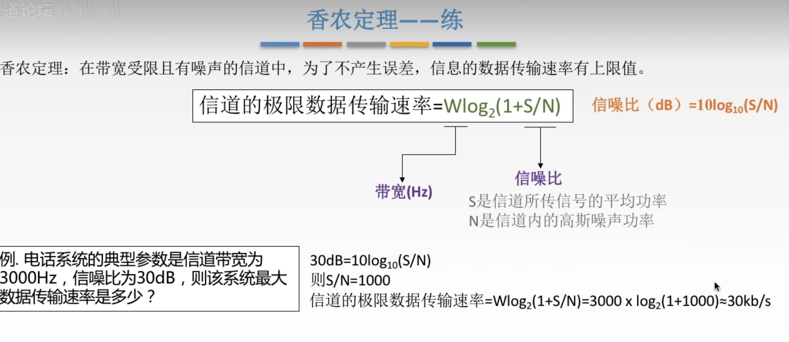

#### 码分复用

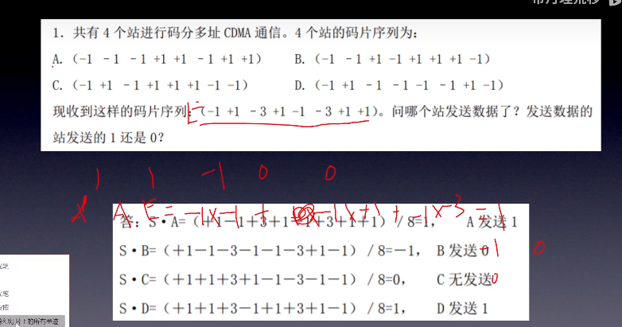

### 第三章

1. 透明传输
2. 差错检测
3. CSMA/CD协议（多点接入、载波监听、碰撞检测）

* 共享式以太网的争用期

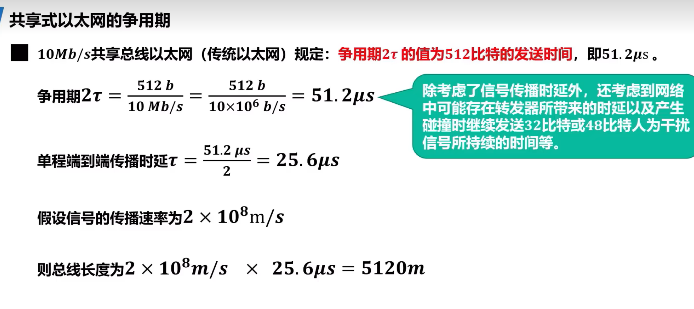

* 共享式以太网的最小帧长和最大帧长

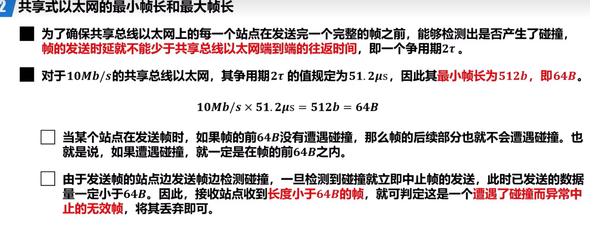

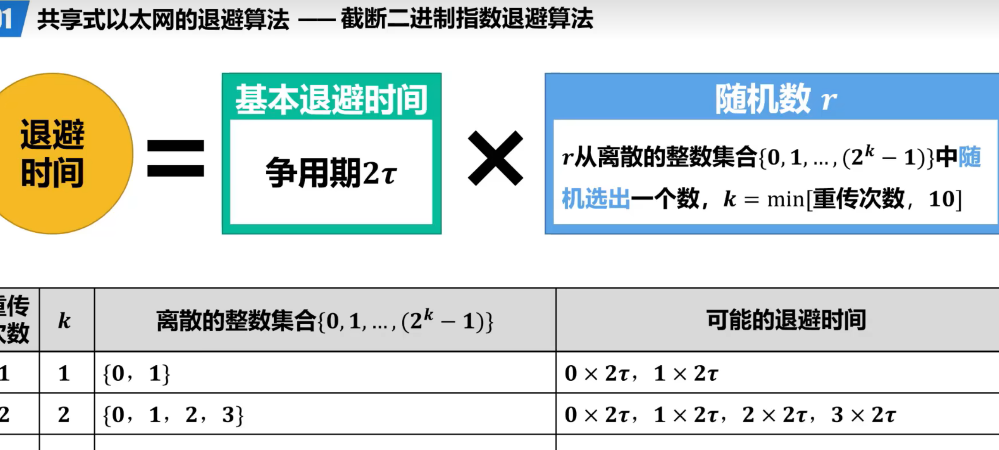

 ## 第四章

1. IP数据包分析

* 首部长度以4个字节为单位

* 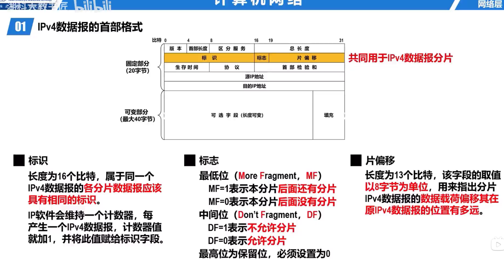

  2. 子网划分
  3. 路由更新

  

  2. 分组转发

## 第五章

1. 流量控制

接收到TCP流量控制：

1. 检查信息的ack的确认字段，将窗口移植那里

   2. 调整窗口大小

   3. 删除缓存区

      

2. 拥塞控制
