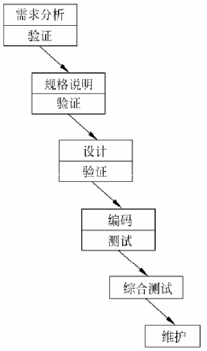

# 软件工程复习

# 绪论

1. 软件危机（原因、表现和解决方法）

a. 原因：

主观原因：

* 忽视需求分析
* 轻视软件维护
* 没有认识到程序只是软件的一部分
* 越到后期如果引用变动代价越高

客观原因：

* 软件是逻辑实体，**具有不可见性**，管理和控制较为困难
* 维护困难
* 程序复杂性随规模增加而增加

b. 表现

* 对软件开发成本和进度估算不准确
* 软件质量不可靠
* 软件不可维护
* 没有适当的文档资料
* 软件成本在计算机系统中所占比例逐年上升
* 软件开发生产率低

c.解决方法

* 对计算机软件应该有正确的认识
* 要吸取和借鉴人类长期从事各种工程项目积累的原理、概念、技术和方法
* 积极开发和使用计算机辅助开发软件
* 探索更好更有效的管理措施和手段对开发过程进行控制和管理

2. 软件生命周期划分

* 软件定义
* 软件开发
* 运行维护

3. 软件过程

* 瀑布模型

从上一阶段接受本阶段的工作对象，作为输入；   

利用输入，完成本阶段活动的内容． 

 本阶段的工作成果作为输出传入下一阶段。

* 原型模型
* 增量模型
* 螺旋模型

## 可行性研究、需求分析

1. 需求分析（必要性及主要任务）

1. 数据流图的绘制
2. 实体联系图
3. 数据字典
4. 需求分析的四项主要任务
   * 确定对系统的综合要求
   * 分析系统的数据要求
   * 到处系统的逻辑模型
   * 修正系统开发计划

## 设计工具

1. 软件结构图
2. 流程图
3. 盒图
4. 判定树
5. 判定表

## 软件测试（测试用例设计）

1. 白盒测试
   * 条件覆盖、判断覆盖、条件组合覆盖
   * 语句覆盖、路径覆盖
2. 黑盒测试
   * 等价类划分、边界值分析

## 面向对象分析

1. 对象模型
   * 类图
2. 功能模型
   * 用例图
3. 建立动态模型
   * 画事件跟踪图（时序图、顺序图）
   * 状态图

## 项目管理

1. 如何进行有效的项目以管理